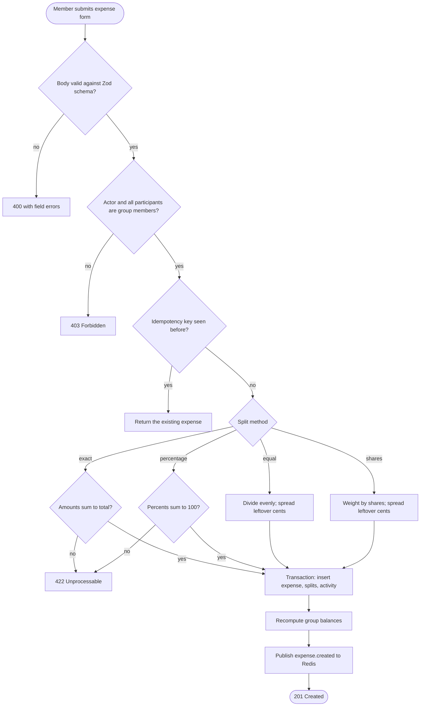

# Activity: add expense

```mermaid
flowchart TD
    S([Member submits expense form]) --> V{Body valid against Zod schema?}
    V -- no --> E400[400 with field errors]
    V -- yes --> M{Actor and all participants are group members?}
    M -- no --> E403[403 Forbidden]
    M -- yes --> K{Idempotency key seen before?}
    K -- yes --> R200[Return the existing expense]
    K -- no --> SM{Split method}
    SM -- equal --> EQ[Divide evenly; spread leftover cents]
    SM -- exact --> EX{Amounts sum to total?}
    SM -- percentage --> PC{Percents sum to 100?}
    SM -- shares --> SH[Weight by shares; spread leftover cents]
    EX -- no --> E422[422 Unprocessable]
    PC -- no --> E422
    EX -- yes --> TX
    PC -- yes --> TX
    EQ --> TX
    SH --> TX
    TX[Transaction: insert expense, splits, activity] --> BAL[Recompute group balances]
    BAL --> PUB[Publish expense.created to Redis]
    PUB --> OK([201 Created])
```
