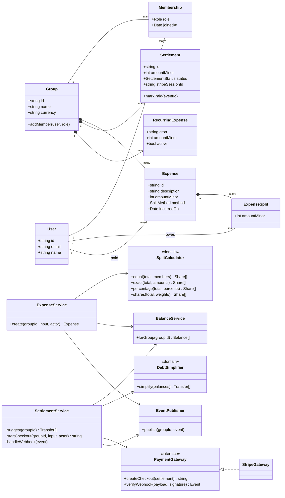

# Class diagram

```mermaid
classDiagram
    direction LR

    class User {
        +string id
        +string email
        +string name
    }
    class Group {
        +string id
        +string name
        +string currency
        +addMember(user, role)
    }
    class Membership {
        +Role role
        +Date joinedAt
    }
    class Expense {
        +string id
        +string description
        +int amountMinor
        +SplitMethod method
        +Date incurredOn
    }
    class ExpenseSplit {
        +int amountMinor
    }
    class Settlement {
        +string id
        +int amountMinor
        +SettlementStatus status
        +string stripeSessionId
        +markPaid(eventId)
    }
    class RecurringExpense {
        +string cron
        +int amountMinor
        +bool active
    }

    User "1" -- "many" Membership
    Group "1" -- "many" Membership
    Group "1" *-- "many" Expense
    Expense "1" *-- "many" ExpenseSplit
    User "1" -- "many" ExpenseSplit : owes
    User "1" -- "many" Expense : paid
    Group "1" *-- "many" Settlement
    Group "1" *-- "many" RecurringExpense

    class SplitCalculator {
        <<domain>>
        +equal(total, members) Share[]
        +exact(total, amounts) Share[]
        +percentage(total, percents) Share[]
        +shares(total, weights) Share[]
    }
    class DebtSimplifier {
        <<domain>>
        +simplify(balances) Transfer[]
    }
    class BalanceService {
        +forGroup(groupId) Balance[]
    }
    class ExpenseService {
        +create(groupId, input, actor) Expense
    }
    class SettlementService {
        +suggest(groupId) Transfer[]
        +startCheckout(groupId, input, actor) string
        +handleWebhook(event)
    }
    class EventPublisher {
        +publish(groupId, event)
    }
    class PaymentGateway {
        <<interface>>
        +createCheckout(settlement) string
        +verifyWebhook(payload, signature) Event
    }
    class StripeGateway

    ExpenseService --> SplitCalculator
    ExpenseService --> BalanceService
    ExpenseService --> EventPublisher
    SettlementService --> BalanceService
    SettlementService --> DebtSimplifier
    SettlementService --> PaymentGateway
    SettlementService --> EventPublisher
    PaymentGateway <|.. StripeGateway
```
