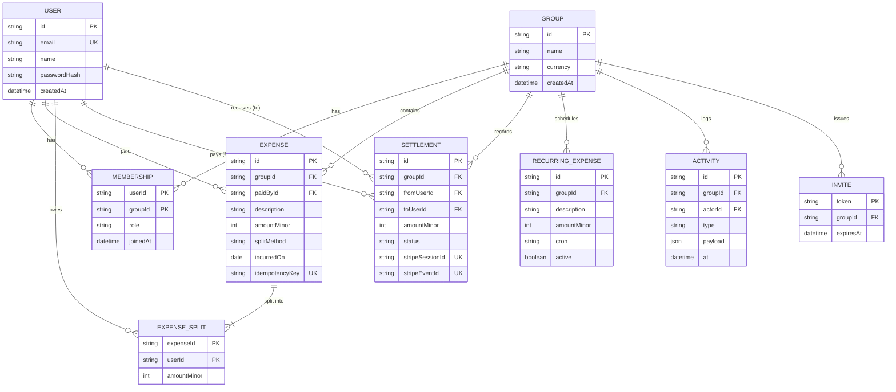

# Entity-relationship diagram

Mirrors `apps/api/prisma/schema.prisma`.

```mermaid
erDiagram
    USER ||--o{ MEMBERSHIP : has
    GROUP ||--o{ MEMBERSHIP : has
    GROUP ||--o{ EXPENSE : contains
    USER ||--o{ EXPENSE : paid
    EXPENSE ||--|{ EXPENSE_SPLIT : "split into"
    USER ||--o{ EXPENSE_SPLIT : owes
    GROUP ||--o{ SETTLEMENT : records
    USER ||--o{ SETTLEMENT : "pays (from)"
    USER ||--o{ SETTLEMENT : "receives (to)"
    GROUP ||--o{ RECURRING_EXPENSE : schedules
    GROUP ||--o{ ACTIVITY : logs
    GROUP ||--o{ INVITE : issues

    USER {
        string id PK
        string email UK
        string name
        string passwordHash
        datetime createdAt
    }
    GROUP {
        string id PK
        string name
        string currency
        datetime createdAt
    }
    MEMBERSHIP {
        string userId PK
        string groupId PK
        string role
        datetime joinedAt
    }
    EXPENSE {
        string id PK
        string groupId FK
        string paidById FK
        string description
        int amountMinor
        string splitMethod
        date incurredOn
        string idempotencyKey UK
    }
    EXPENSE_SPLIT {
        string expenseId PK
        string userId PK
        int amountMinor
    }
    SETTLEMENT {
        string id PK
        string groupId FK
        string fromUserId FK
        string toUserId FK
        int amountMinor
        string status
        string stripeSessionId UK
        string stripeEventId UK
    }
    RECURRING_EXPENSE {
        string id PK
        string groupId FK
        string description
        int amountMinor
        string cron
        boolean active
    }
    ACTIVITY {
        string id PK
        string groupId FK
        string actorId FK
        string type
        json payload
        datetime at
    }
    INVITE {
        string token PK
        string groupId FK
        datetime expiresAt
    }
```
