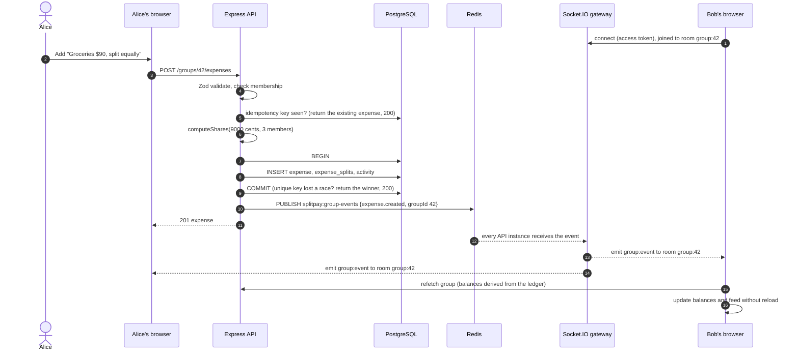

# Sequence: add expense and live update

```mermaid
sequenceDiagram
    autonumber
    actor A as Alice
    participant WA as Alice's browser
    participant API as Express API
    participant DB as PostgreSQL
    participant R as Redis
    participant GW as Socket.IO gateway
    participant WB as Bob's browser

    WB->>GW: connect (access token), joined to room group:42
    A->>WA: Add "Groceries $90, split equally"
    WA->>API: POST /groups/42/expenses
    API->>API: Zod validate, check membership
    API->>DB: idempotency key seen? (return the existing expense, 200)
    API->>API: computeShares(9000 cents, 3 members)
    API->>DB: BEGIN
    API->>DB: INSERT expense, expense_splits, activity
    API->>DB: COMMIT (unique key lost a race? return the winner, 200)
    API->>R: PUBLISH splitpay:group-events {expense.created, groupId 42}
    API-->>WA: 201 expense
    R-->>GW: every API instance receives the event
    GW-->>WB: emit group:event to room group:42
    GW-->>WA: emit group:event to room group:42
    WB->>API: refetch group (balances derived from the ledger)
    WB->>WB: update balances and feed without reload
```
