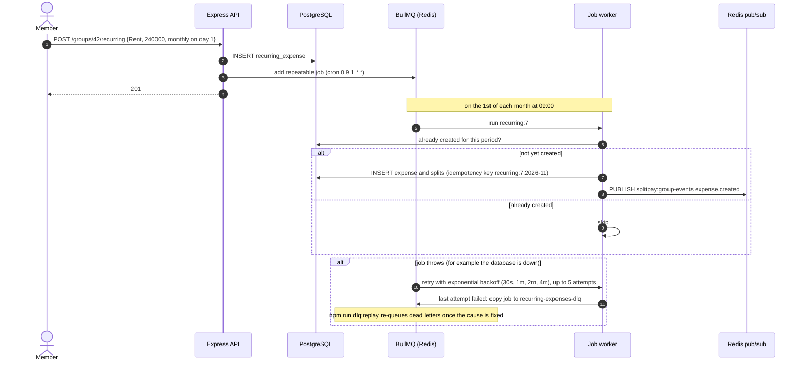

# Sequence: recurring expense job

```mermaid
sequenceDiagram
    autonumber
    actor M as Member
    participant API as Express API
    participant DB as PostgreSQL
    participant Q as BullMQ (Redis)
    participant J as Job worker
    participant R as Redis pub/sub

    M->>API: POST /groups/42/recurring {Rent, 240000, monthly on day 1}
    API->>DB: INSERT recurring_expense
    API->>Q: add repeatable job (cron 0 9 1 * *)
    API-->>M: 201

    Note over Q,J: on the 1st of each month at 09:00
    Q->>J: run recurring:7
    J->>DB: already created for this period?
    alt not yet created
        J->>DB: INSERT expense and splits (idempotency key recurring:7:2026-11)
        J->>R: PUBLISH splitpay:group-events expense.created
    else already created
        J->>J: skip
    end

    alt job throws (for example the database is down)
        Q->>J: retry with exponential backoff (30s, 1m, 2m, 4m), up to 5 attempts
        J->>Q: last attempt failed: copy job to recurring-expenses-dlq
        Note over Q: npm run dlq:replay re-queues dead letters once the cause is fixed
    end
```

Retries are safe because the idempotency key makes a second successful run create nothing.
