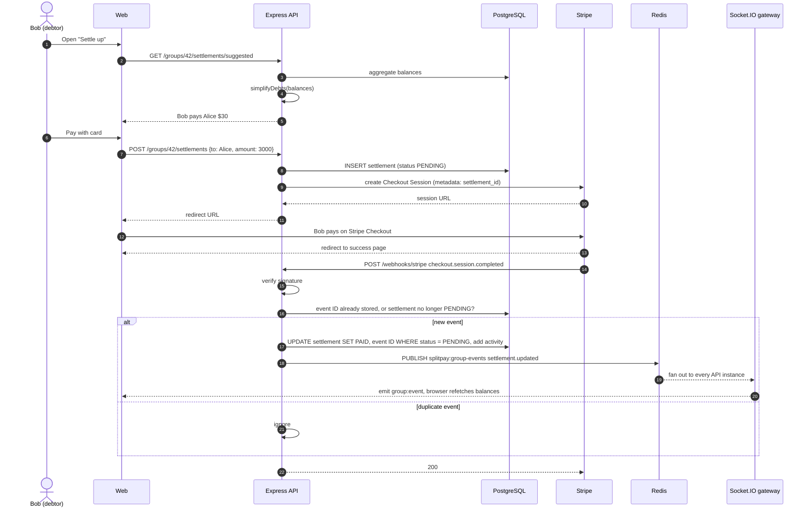

# Sequence: settle up with Stripe (test mode)

```mermaid
sequenceDiagram
    autonumber
    actor B as Bob (debtor)
    participant W as Web
    participant API as Express API
    participant DB as PostgreSQL
    participant S as Stripe
    participant R as Redis
    participant GW as Socket.IO gateway

    B->>W: Open "Settle up"
    W->>API: GET /groups/42/settlements/suggested
    API->>DB: aggregate balances
    API->>API: simplifyDebts(balances)
    API-->>W: Bob pays Alice $30
    B->>W: Pay with card
    W->>API: POST /groups/42/settlements {to: Alice, amount: 3000}
    API->>DB: INSERT settlement (status PENDING)
    API->>S: create Checkout Session (metadata: settlement_id)
    S-->>API: session URL
    API-->>W: redirect URL
    W->>S: Bob pays on Stripe Checkout
    S-->>W: redirect to success page

    S->>API: POST /webhooks/stripe checkout.session.completed
    API->>API: verify signature
    API->>DB: event ID already stored, or settlement no longer PENDING?
    alt new event
        API->>DB: UPDATE settlement SET PAID, event ID WHERE status = PENDING, add activity
        API->>R: PUBLISH splitpay:group-events settlement.updated
        R-->>GW: fan out to every API instance
        GW-->>W: emit group:event, browser refetches balances
    else duplicate event
        API->>API: ignore
    end
    API-->>S: 200
```
