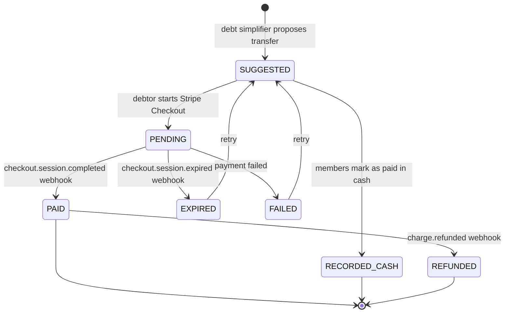

# Settlement lifecycle (state machine)

```mermaid
stateDiagram-v2
    [*] --> SUGGESTED: debt simplifier proposes transfer
    SUGGESTED --> PENDING: debtor starts Stripe Checkout
    SUGGESTED --> RECORDED_CASH: members mark as paid in cash
    PENDING --> PAID: checkout.session.completed webhook
    PENDING --> EXPIRED: checkout.session.expired webhook
    PENDING --> FAILED: payment failed
    EXPIRED --> SUGGESTED: retry
    FAILED --> SUGGESTED: retry
    PAID --> REFUNDED: charge.refunded webhook
    PAID --> [*]
    RECORDED_CASH --> [*]
    REFUNDED --> [*]
```
