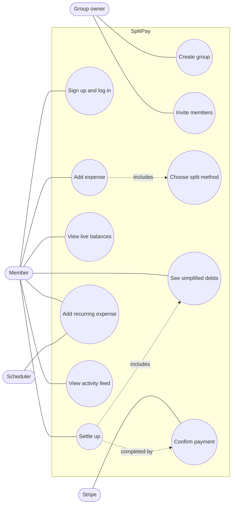

# Use cases

```mermaid
flowchart LR
    Member([Member])
    Owner([Group owner])
    Stripe([Stripe])
    Scheduler([Scheduler])

    subgraph SplitPay
        UC1((Sign up and log in))
        UC2((Create group))
        UC3((Invite members))
        UC4((Add expense))
        UC5((Choose split method))
        UC6((View live balances))
        UC7((See simplified debts))
        UC8((Settle up))
        UC9((Confirm payment))
        UC10((Add recurring expense))
        UC11((View activity feed))
    end

    Member --- UC1
    Member --- UC4
    Member --- UC6
    Member --- UC7
    Member --- UC8
    Member --- UC10
    Member --- UC11
    Owner --- UC2
    Owner --- UC3
    Stripe --- UC9
    Scheduler --- UC10
    UC4 -. includes .-> UC5
    UC8 -. includes .-> UC7
    UC8 -. completed by .-> UC9
```

The group owner is also a member and can do everything a member can.
